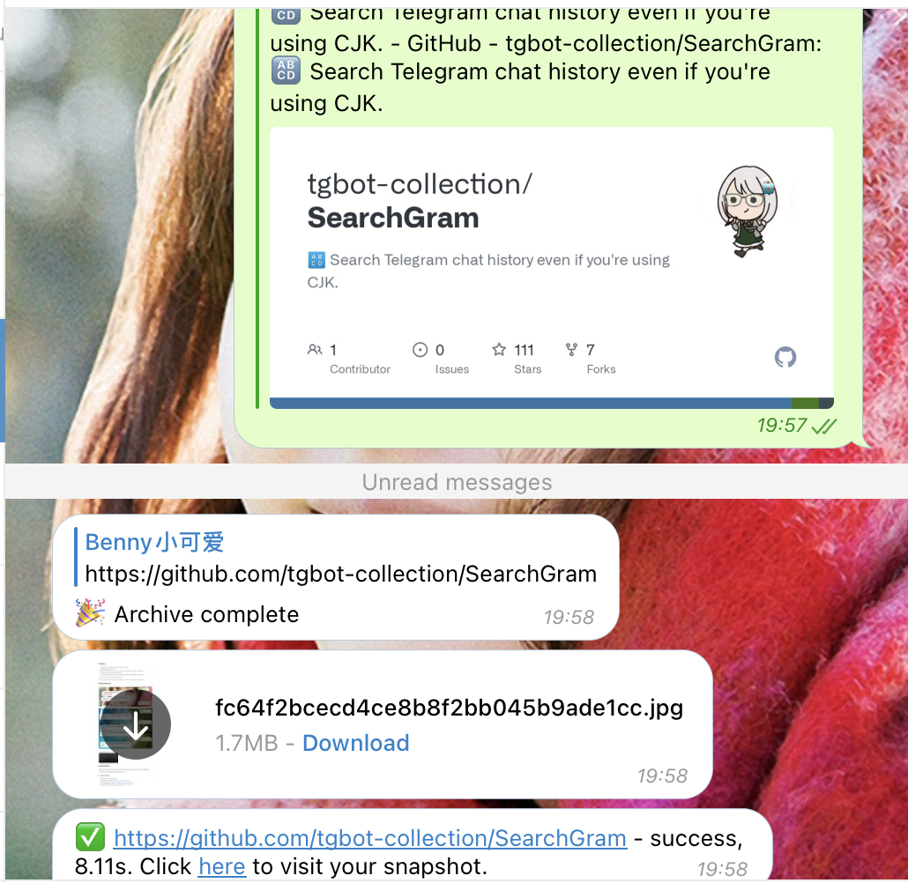
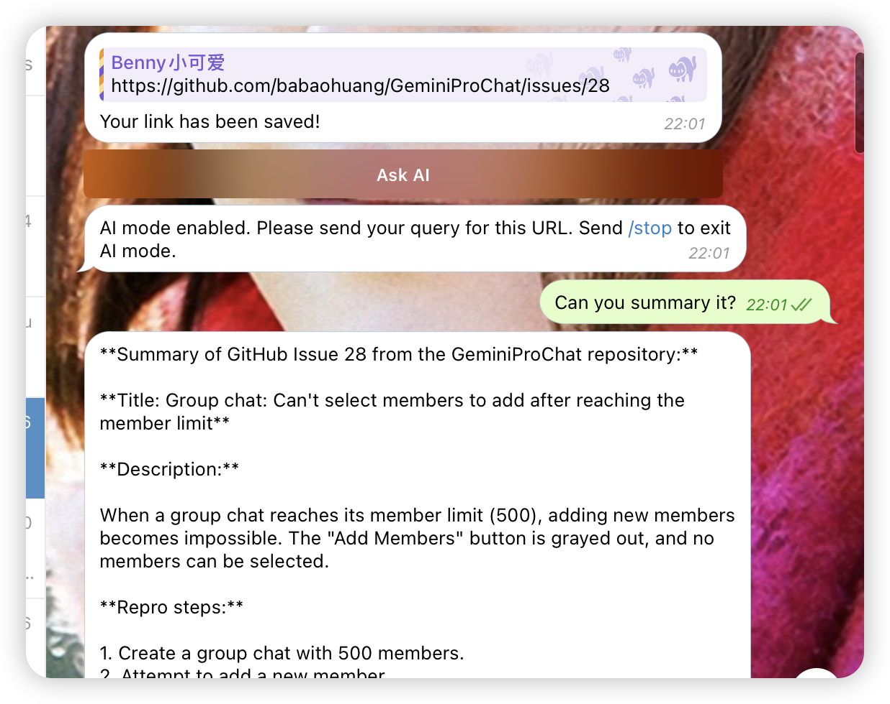

# archiver

[](https://codecov.io/gh/tgbot-collection/archiver)
[](https://github.com/tgbot-collection/archiver/actions/workflows/builder.yaml)
[](https://hub.docker.com/r/bennythink/archiver)

🗜 Internet Archive: Wayback Machine bot

[Wayback Machine](https://t.me/wayback_machine_bot)

# WayBack Machine bot

Send any link to this bot, and it will save it to [Internet Archive](https://archive.org/).

A screenshot of this page will be sent to you as well.

Optionally, you can use AI mode to get a more accurate screenshot.

The AI functionality is powered by [Gemini](https://ai.google.dev/).

# screenshots

## save to wayback machine


## get screenshot



# AI mode



# commands

```
start - start Wayback Machine bot
about - about this bot
ping - ping server
stop - stop AI mode
```

# Features

* create snapshot

# Privacy notice

> [!IMPORTANT]
> This bot **WILL NEVER** save your personal information unless you choose to use AI mode.

# Development

## Build project locally

```bash
git clone https://github.com/tgbot-collection/archiver
cd archiver
go build .
TOKEN=13245 DRIVER=$(which chromedriver) ./archiver
```

## docker

```bash
docker run -e DRIVER=$(which chromedriver) TOKEN=1234 bennythink/archiver
```

## prebuilt binary

Download it from release, and then

```shell
TOKEN=1234 DRIVER=$(which chromedriver) ./archiver
```

# License

Apache License
Version 2.0
